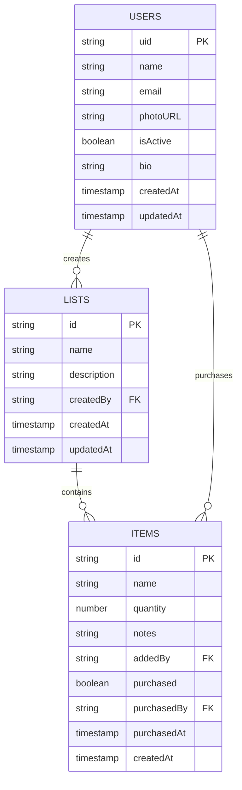

# 🛒 Lista Mercado Inteligente

<div align="center">
  
  
  ### 🗄️ Modelo de Dados



### 🔒 Regras de Segurança

<details>
<summary><strong>📚 Firestore Rules</strong></summary>

```javascript
// Usuários podem ler todos os perfis
// Podem editar apenas o próprio perfil
// Admins podem alterar isActive
match /users/{userId} {
  allow read: if request.auth != null;
  allow write: if request.auth.uid == userId 
    || (request.auth != null && 
        resource.data.diff(request.resource.data).affectedKeys() == ['isActive'].toSet());
}

// Listas são públicas para usuários ativos
// Itens seguem as mesmas regras da lista pai
match /lists/{listId} {
  allow read, write: if request.auth != null && 
    get(/databases/$(database)/documents/users/$(request.auth.uid)).data.isActive == true;
}
```

</details>

<details>
<summary><strong>🗂️ Storage Rules</strong></summary>

```javascript
// Avatares: apenas o próprio usuário pode fazer upload
// Limite: 15MB, apenas imagens
match /avatars/{userId}/{allPaths=**} {
  allow read: if true;
  allow write: if request.auth.uid == userId
    && request.resource.size < 15 * 1024 * 1024
    && request.resource.contentType.matches('image/.*');
}
```

</details>ra organizar listas de compras em tempo real
  
  [](https://react.dev/)
  [](https://www.typescriptlang.org/)
  [](https://vitejs.dev/)
  [](https://firebase.google.com/)
  [](https://tailwindcss.com/)
  [](https://www.framer.com/motion/)
  
  [](https://web.dev/progressive-web-apps/)
  [](https://opensource.org/licenses/MIT)
  [](https://firebase.google.com/products/hosting)
</div>

---

## ✨ Visão Geral

Uma aplicação moderna e intuitiva para gerenciar listas de compras de forma colaborativa, com foco em **performance**, **UX** e **tempo real**.

### 🎯 Principais Características

| 🎨 **Design** | ⚡ **Performance** | 🔐 **Segurança** | 🤝 **Colaborativo** |
|:---:|:---:|:---:|:---:|
| Interface responsiva com animações Framer Motion | React 19 + Vite 7 para máxima velocidade | Autenticação Firebase robusta | Sincronização em tempo real |
| Tema claro/escuro automático | PWA com cache inteligente | Fluxo de aprovação de usuários | Múltiplos usuários por lista |
| Componentes reutilizáveis | Lazy loading e code splitting | Regras Firestore granulares | Histórico de ações |

### 🌟 Funcionalidades Destacadas

- 🎭 **Animações suaves** com Framer Motion para transições naturais
- 🔄 **Sincronização instantânea** via Cloud Firestore 
- 🎨 **Tema adaptativo** persistido no navegador
- 📱 **Progressive Web App** - instale como app nativo
- 👥 **Gestão de usuários** com sistema de aprovação
- 📊 **Dashboard intuitivo** com contadores e status visuais

## 🚀 Principais Funcionalidades

<details>
<summary><strong>📝 Gerenciamento de Listas</strong></summary>

- ✅ **Criação e edição** de listas personalizadas
- 🔢 **Contadores automáticos** de itens pendentes/comprados  
- 📋 **Adição de itens** com quantidade e observações
- 🔄 **Reordenação automática** por status
- 🗑️ **Exclusão** com confirmação de segurança

</details>

<details>
<summary><strong>🤝 Colaboração em Tempo Real</strong></summary>

- ⚡ **Sincronização instantânea** entre usuários
- 👤 **Registro de autoria** em cada ação
- ✅ **Marcação de compras** com histórico
- 👥 **Múltiplos colaboradores** por lista
- 📊 **Feedback visual** imediato

</details>

<details>
<summary><strong>👨‍💼 Gestão de Usuários</strong></summary>

- 🔐 **Sistema de aprovação** para novos usuários
- ⚖️ **Painel administrativo** para gerenciar acessos
- 🚫 **Suspensão/ativação** de contas
- 📧 **Autenticação por email** segura
- 👤 **Perfis personalizáveis**

</details>

<details>
<summary><strong>🎨 Interface e UX</strong></summary>

- 🌓 **Tema claro/escuro** com transições suaves
- 📱 **Design responsivo** mobile-first
- 🎭 **Animações** com Framer Motion
- 💾 **PWA** - instalável como app nativo
- 🖼️ **Upload de avatar** com progress bar

</details>

## 🛠️ Stack Tecnológica

### Frontend
<div align="center">

| Tecnologia | Versão | Descrição |
|:---:|:---:|:---|
|  | **19** | Biblioteca principal com Concurrent Features |
|  | **5.6** | Type safety e melhor DX |
|  | **7** | Build tool ultra-rápido |
|  | **4** | Utility-first CSS framework |
|  | **Latest** | Animações e transições |

</div>

### Backend & Services
<div align="center">

| Serviço | Uso | Recursos |
|:---:|:---|:---|
|  | **Autenticação** | Email/senha, aprovação manual |
|  | **Database** | NoSQL em tempo real |
|  | **Arquivos** | Upload de avatars |
|  | **Deploy** | CDN global |

</div>

### Ferramentas & DevOps
<div align="center">

| Ferramenta | Propósito |
|:---:|:---|
|  | Linting e code quality |
|  | Roteamento SPA |
|  | Biblioteca de ícones |
|  | Service Worker e manifesto |

</div>

## 🏗️ Arquitetura do Código

### 📁 Estrutura Feature-Driven

A organização segue o padrão **Feature-Driven Development** para máxima escalabilidade:

```bash
📦 src/
├── 🎯 features/           # Funcionalidades principais
│   ├── 🔐 auth/          # Sistema de login/registro
│   │   ├── AuthPage.tsx
│   │   └── components/   # LoginForm, RegisterForm, AuthHero
│   ├── 📱 layout/        # Shell da aplicação  
│   │   └── AppShell.tsx  # Sidebar animada + navegação
│   ├── 📝 lists/         # Gerenciamento de listas
│   │   ├── ListsPage.tsx
│   │   └── services.ts   # APIs Firestore
│   ├── 👤 profile/       # Perfil do usuário
│   │   ├── ProfilePage.tsx
│   │   └── services.ts   # Upload de avatar
│   └── 👥 users/         # Painel administrativo
│       ├── UsersPage.tsx
│       └── services.ts   # Aprovação de usuários
├── 🧩 components/        # Design System
│   ├── ui/              # Button, Card, Input, Modal...
│   └── feedback/        # Loaders, Dialogs...
├── 🌍 contexts/          # Estado global
│   ├── auth-context.tsx # Usuário logado
│   └── theme-context.tsx# Tema claro/escuro  
├── 🪝 hooks/            # Lógica reutilizável
├── 🛣️ routes/           # Roteamento protegido
├── 📋 types/            # Contratos TypeScript
└── 🔧 utils/           # Helpers e utilitários
```

### 🎨 Design Patterns

- **🔄 Context Pattern**: Estado global para auth e tema
- **🎯 Feature Slicing**: Cada feature é auto-contida
- **🎭 Component Composition**: UI components reutilizáveis  
- **🔒 Protected Routes**: Controle de acesso baseado em auth
- **📡 Real-time Sync**: Hooks para sincronização Firestore

## Modelo de Dados (Firestore & Storage)
- **Coleção `users`:** documentos com `uid`, `name`, `email`, `photoURL`, `isActive`, `bio`, `createdAt`, `updatedAt`.
  - Regras (`firestore.rules`): qualquer usuário autenticado pode ler; updates são permitidos para o próprio usuário ou para alterar apenas `isActive` (fluxo de aprovação).
- **Coleção `lists`:** cada documento trata de uma lista com `name`, `description`, dados do criador e timestamps.
  - **Subcoleção `items`:** itens de cada lista contêm `name`, `quantity`, `notes`, autor, status de compra e metadados de quem comprou.
- **Storage (`storage.rules`):** avatares são salvos em `avatars/{uid}/`. Apenas o dono pode escrever, com limite de 15 MB e tipo `image/*`.

## 📋 Pré-requisitos

### 💻 Ambiente de Desenvolvimento

| Ferramenta | Versão Mínima | Recomendada | Status |
|:---:|:---:|:---:|:---:|
|  | `18.18+` | `20 LTS` | ✅ Obrigatório |
|  | `9+` | `Latest` | ✅ Obrigatório |
|  | `2.30+` | `Latest` | ✅ Obrigatório |

### ☁️ Serviços Externos

- 🔥 **Conta Firebase** com os seguintes serviços habilitados:
  - 🔐 **Authentication** (Email/Password)
  - 📊 **Cloud Firestore** 
  - 🗂️ **Cloud Storage**
  - 🌐 **Hosting** (para deploy)

### 🛠️ Firebase CLI

```bash
# Instale o Firebase CLI (obrigatório para deploy)
npm install -g firebase-tools

# Verificar instalação
firebase --version

# Login na sua conta Google/Firebase
firebase login
```

## ⚡ Guia de Instalação

### 1️⃣ Clone o Repositório

```bash
git clone https://github.com/PedroBolson/-Supermarket-shopping-list.git
cd lista-mercado
```

### 2️⃣ Instale as Dependências

```bash
# Usando npm
npm install

# Ou usando yarn
yarn install

# Ou usando pnpm
pnpm install
```

### 3️⃣ Configure o Firebase

<details>
<summary><strong>🔧 Variáveis de Ambiente</strong></summary>

Crie um arquivo `.env.local` na raiz do projeto:

```bash
# Firebase Config
VITE_FIREBASE_API_KEY=your_api_key_here
VITE_FIREBASE_AUTH_DOMAIN=your_project.firebaseapp.com
VITE_FIREBASE_PROJECT_ID=your_project_id
VITE_FIREBASE_STORAGE_BUCKET=your_project.appspot.com
VITE_FIREBASE_MESSAGING_SENDER_ID=your_sender_id
VITE_FIREBASE_APP_ID=your_app_id
VITE_FIREBASE_MEASUREMENT_ID=your_measurement_id  # Opcional
```

> 💡 **Dica**: Encontre essas informações no console do Firebase → Project Settings → General

</details>

### 4️⃣ Configure o Firebase Console

```bash
# 1. Habilite Authentication (Email/Password)
# 2. Crie projeto Firestore
# 3. Configure Storage
# 4. Deploy das regras de segurança

firebase login
firebase deploy --only firestore:rules,storage:rules
```

### 5️⃣ Inicie o Desenvolvimento

```bash
npm run dev
```

🚀 **Pronto!** Acesse `http://localhost:5173` e veja a mágica acontecer!

### � Inicialize o Firebase

```bash
# Se for a primeira vez no projeto
firebase init

# Selecione: Firestore, Storage, Hosting
# Use a configuração existente quando perguntado
```

## 🚀 Scripts Disponíveis

| Script | Descrição | Uso |
|:---:|:---|:---|
| 🔥 `dev` | Servidor de desenvolvimento com HMR | `npm run dev` |
| 🏗️ `build` | Build otimizado para produção | `npm run build` |
| 👀 `preview` | Preview do build (teste PWA) | `npm run preview` |
| 🔍 `lint` | Análise de código com ESLint | `npm run lint` |
| 🧹 `lint:fix` | Corrige problemas automaticamente | `npm run lint --fix` |
| 📋 `type-check` | Verificação de tipos TypeScript | `npm run type-check` |

### 🎯 Workflows Comuns

<details>
<summary><strong>💻 Desenvolvimento Diário</strong></summary>

```bash
# Inicia servidor de dev
npm run dev

# Em outro terminal: watch dos tipos
npm run type-check --watch

# Análise de código
npm run lint
```

</details>

<details>
<summary><strong>🚀 Deploy de Produção</strong></summary>

```bash
# Verifica tipos e lint
npm run type-check && npm run lint

# Build para produção  
npm run build

# Testa o build localmente
npm run preview

# Deploy no Firebase
firebase deploy
```

</details>

## 📱 Testando PWA

### 🔧 Como Testar

```bash
# 1. Build da aplicação
npm run build

# 2. Serve localmente  
npm run preview

# 3. Acesse localhost:4173
```

### ✅ Checklist de Testes

| Funcionalidade | Como Testar | Status |
|:---|:---|:---:|
| **📱 Instalação** | Menu "Instalar app" no navegador | ✅ |
| **⚡ Service Worker** | DevTools → Application → Service Workers | ✅ |
| **📋 Manifesto** | DevTools → Application → Manifest | ✅ |
| **💾 Cache** | DevTools → Application → Storage | ✅ |
| **🔄 Offline** | Desconecte internet e use o app | ✅ |

### 🎯 Lighthouse Score

<div align="center">
  
  
  
  
  
  
  
</div>

## 🌐 Deploy

### 🔥 Firebase Hosting

<details>
<summary><strong>📤 Deploy Automático</strong></summary>

```bash
# Login no Firebase
firebase login

# Build + Deploy em um comando
npm run build && firebase deploy
```

</details>

<details>
<summary><strong>🎯 Deploy Seletivo</strong></summary>

```bash
# Deploy apenas do hosting
firebase deploy --only hosting

# Deploy das regras + hosting  
firebase deploy --only hosting,firestore:rules,storage:rules

# Deploy com preview
firebase hosting:channel:deploy preview
```

</details>

### 🎯 URL de Produção

<div align="center">
  
  [](https://lista-compra-mercado.web.app)
  
  **🌐 Aplicação rodando em produção no Firebase Hosting**
  
</div>

### ⚙️ Configuração Automática

O Firebase já está configurado para:
- ✅ **SPA Routing** - Todas as rotas redirecionam para `index.html`
- ✅ **Gzip Compression** - Assets comprimidos automaticamente  
- ✅ **CDN Global** - Entrega rápida mundialmente
- ✅ **SSL Gratuito** - HTTPS habilitado por padrão

### 🤝 Contribuindo

<div align="center">

[](https://github.com/PedroBolson/-Supermarket-shopping-list/graphs/contributors)
[](https://github.com/PedroBolson/-Supermarket-shopping-list/issues)
[](https://github.com/PedroBolson/-Supermarket-shopping-list/pulls)

</div>

1. 🍴 **Fork** o projeto
2. 🌟 **Crie** sua feature branch (`git checkout -b feature/AmazingFeature`)
3. 💻 **Commit** suas mudanças (`git commit -m 'Add some AmazingFeature'`)
4. 📤 **Push** para a branch (`git push origin feature/AmazingFeature`)
5. 🔄 **Abra** um Pull Request

## 📄 Licença

Este projeto está sob a licença **MIT**. Veja o arquivo [LICENSE](LICENSE) para mais detalhes.

## 👨‍💻 Autor

<div align="center">
  
  
  **Pedro Bolson**
  
  [](https://github.com/PedroBolson)
  [](https://www.linkedin.com/in/pedro-bolson-086a03337)
  [](mailto:pedbolson@gmail.com)
</div>

---

<div align="center">
  <p><strong>⭐ Se este projeto te ajudou, considere dar uma estrela!</strong></p>
  
  [](https://github.com/PedroBolson/-Supermarket-shopping-list/stargazers)
  
  <p><em>Feito com ❤️ e muito ☕</em></p>
</div>
