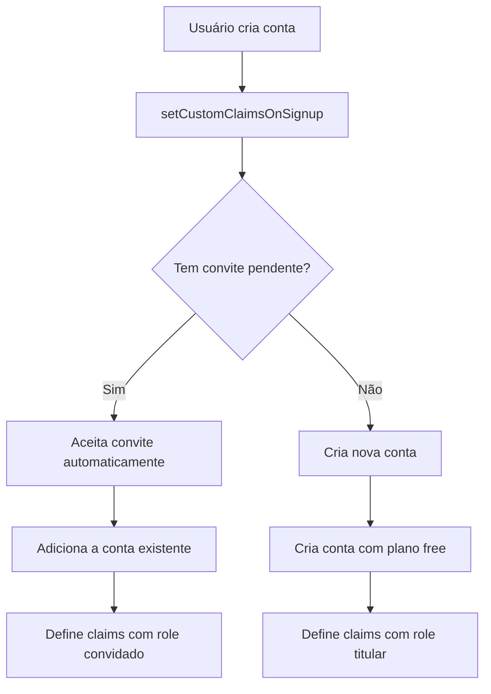
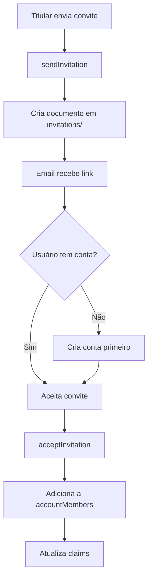
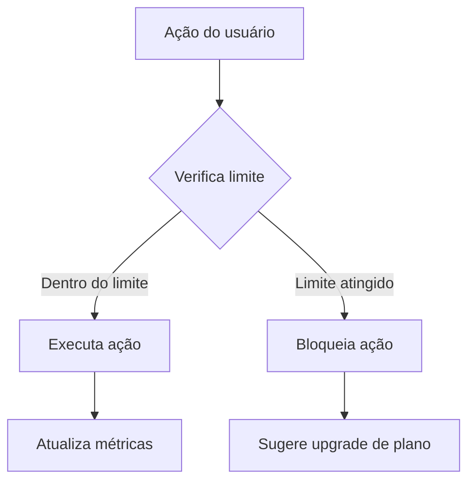

# Lista Mercado - Sistema Multi-Conta

Sistema completo de gerenciamento de listas de compras com suporte multi-conta, planos, papéis e controle de membros.

## 🏗️ Arquitetura

### Stack Tecnológica

- **Frontend**: React 19 + TypeScript + Vite + TailwindCSS
- **Backend**: Firebase (Auth, Firestore, Storage, Cloud Functions)
- **CI/CD**: GitHub Actions
- **Segurança**: Firebase App Check + Regras de Segurança

### Modelo de Dados

```
accounts/
├── {accountId}/
    ├── id: string
    ├── name: string
    ├── titularId: string
    ├── planId: string
    ├── status: 'active' | 'suspended' | 'expired' | 'pending'
    ├── expiresAt: Date | null
    ├── limits: { maxMembers, maxLists, maxItemsPerList, maxStorageMB }
    ├── metrics: { currentMembers, currentLists, currentStorageMB }
    ├── isLifetime: boolean
    ├── createdAt: Date
    └── updatedAt: Date

accountMembers/
├── {accountId}/
    └── members/
        └── {uid}/
            ├── uid: string
            ├── accountId: string
            ├── role: 'titular' | 'convidado' | 'master'
            ├── status: 'active' | 'suspended' | 'pending'
            ├── invitedBy: string
            ├── invitedAt: Date
            ├── joinedAt: Date | null
            ├── suspendedAt: Date | null
            └── suspendedBy: string | null

users/
├── {uid}/
    ├── uid: string
    ├── email: string
    ├── name: string
    ├── photoURL: string | null
    ├── bio: string
    ├── defaultAccountId: string | null
    ├── isActive: boolean
    ├── isMaster: boolean
    ├── consents: { termsAccepted, privacyAccepted, marketingAccepted, acceptedAt }
    ├── supportFlags: { canAccessAllAccounts, canModifyPlans, canViewAudits }
    ├── createdAt: Date
    └── updatedAt: Date

plans/
├── {planId}/
    ├── id: string
    ├── name: string
    ├── description: string
    ├── price: number
    ├── interval: 'monthly' | 'yearly' | 'lifetime'
    ├── limits: { maxMembers, maxLists, maxItemsPerList, maxStorageMB }
    ├── features: string[]
    ├── isActive: boolean
    ├── order: number
    ├── createdAt: Date
    └── updatedAt: Date

invitations/
├── {token}/
    ├── token: string
    ├── accountId: string
    ├── email: string
    ├── role: 'convidado'
    ├── status: 'pending' | 'accepted' | 'expired' | 'revoked'
    ├── invitedBy: string
    ├── invitedByName: string
    ├── accountName: string
    ├── createdAt: Date
    ├── expiresAt: Date
    ├── acceptedAt: Date | null
    └── acceptedBy: string | null

lists/
├── {listId}/
    ├── id: string
    ├── accountId: string
    ├── name: string
    ├── description: string | null
    ├── createdBy: string
    ├── createdByName: string
    ├── createdByPhoto: string | null
    ├── createdAt: Date
    ├── updatedAt: Date
    └── items/
        └── {itemId}/
            ├── id: string
            ├── listId: string
            ├── name: string
            ├── quantity: string | null
            ├── notes: string | null
            ├── createdBy: string
            ├── createdByName: string
            ├── createdByPhoto: string | null
            ├── isPurchased: boolean
            ├── purchasedBy: string | null
            ├── purchasedByName: string | null
            ├── purchasedByPhoto: string | null
            ├── purchasedAt: Date | null
            ├── createdAt: Date
            └── updatedAt: Date

audits/
├── {docId}/
    ├── id: string
    ├── accountId: string | null
    ├── action: string
    ├── performedBy: string
    ├── performedByName: string
    ├── targetType: 'account' | 'member' | 'invitation' | 'plan' | 'list' | 'user'
    ├── targetId: string
    ├── details: Record<string, unknown>
    ├── ipAddress: string
    ├── userAgent: string
    └── timestamp: Date
```

## 👥 Papéis e Permissões

### Titular (Dono da Conta)
- Gerenciar membros (convidar, suspender, remover)
- Enviar e revogar convites
- Configurar a conta
- Transferir propriedade
- Trocar de plano
- Todas as permissões de convidado

### Convidado (Membro)
- Visualizar e gerenciar listas da conta
- Adicionar e editar itens
- Colaborar com outros membros

### Administrador Master (Staff)
- Acesso completo a todas as contas
- Gerenciar planos
- Visualizar logs de auditoria
- Conceder acesso vitalício
- Suspender contas
- Promover/rebaixar usuários

## 🔐 Segurança

### Custom Claims
Cada usuário possui claims personalizadas no token JWT:
```typescript
{
  role: 'titular' | 'convidado' | 'master',
  accountIds: string[],
  defaultAccountId: string,
  master: boolean
}
```

### Regras de Segurança Firestore
- Leitura/escrita baseada em papéis
- Validação de limites de plano
- Isolamento por conta (accountId)
- Proteção de campos sensíveis

### Regras de Segurança Storage
- Acesso baseado em membros da conta
- Validação de tamanho de arquivo
- Controle de quota por conta

### App Check
- Proteção contra bots e abuso
- Validação com reCAPTCHA v3
- Token refresh automático

## 🚀 Cloud Functions

### Triggers
- `setCustomClaimsOnSignup`: Configura claims ao criar usuário

### Callable Functions
**Convites:**
- `sendInvitation`: Enviar convite para novo membro
- `acceptInvitation`: Aceitar convite pendente
- `revokeInvitation`: Revogar convite pendente

**Membros:**
- `suspendMember`: Suspender/reativar membro
- `removeMember`: Remover membro da conta
- `transferOwnership`: Transferir propriedade da conta

**Planos:**
- `switchPlan`: Trocar plano da conta
- `grantLifetimeAccess`: Conceder acesso vitalício (master only)
- `updateAccountLimits`: Atualizar limites customizados (master only)

**Administração:**
- `promoteToMaster`: Promover usuário a master (master only)
- `demoteFromMaster`: Rebaixar usuário de master (master only)
- `suspendAccount`: Suspender/reativar conta (master only)

### Scheduled Functions
- `checkExpiredAccounts`: Marca contas expiradas (diariamente 02:00)
- `checkExpiredInvitations`: Marca convites expirados (diariamente 03:00)

## 📦 Instalação

### Pré-requisitos
- Node.js 20+
- Firebase CLI
- Conta Firebase com plano Blaze

### Setup

1. **Clone o repositório**
```bash
git clone https://github.com/seu-usuario/lista-mercado.git
cd lista-mercado
```

2. **Instale as dependências**
```bash
# Frontend
npm install

# Functions
cd functions
npm install
cd ..
```

3. **Configure variáveis de ambiente**
```bash
cp .env.example .env
```

Edite `.env` com suas credenciais Firebase.

4. **Configure Firebase**
```bash
firebase login
firebase use --add
```

5. **Deploy das regras de segurança**
```bash
firebase deploy --only firestore:rules,storage:rules
```

6. **Deploy das Cloud Functions**
```bash
cd functions
npm run build
cd ..
firebase deploy --only functions
```

7. **Crie planos iniciais no Firestore**
```javascript
// Execute no console do Firebase
const plansRef = db.collection('plans');

// Plano Free
await plansRef.doc('free').set({
  name: 'Free',
  description: 'Plano gratuito com funcionalidades básicas',
  price: 0,
  interval: 'lifetime',
  limits: {
    maxMembers: 5,
    maxLists: 10,
    maxItemsPerList: 50,
    maxStorageMB: 100
  },
  features: ['Até 5 membros', 'Até 10 listas', '100MB de armazenamento'],
  isActive: true,
  order: 1,
  createdAt: new Date(),
  updatedAt: new Date()
});

// Plano Premium
await plansRef.doc('premium').set({
  name: 'Premium',
  description: 'Plano premium com recursos ilimitados',
  price: 9.90,
  interval: 'monthly',
  limits: {
    maxMembers: 50,
    maxLists: 100,
    maxItemsPerList: 500,
    maxStorageMB: 1000
  },
  features: ['Até 50 membros', 'Até 100 listas', '1GB de armazenamento', 'Suporte prioritário'],
  isActive: true,
  order: 2,
  createdAt: new Date(),
  updatedAt: new Date()
});
```

8. **Inicie o servidor de desenvolvimento**
```bash
npm run dev
```

## 🧪 Testes

### Testes Locais com Emuladores
```bash
firebase emulators:start
```

### Testes de Functions
```bash
cd functions
npm test
```

## 📝 Scripts Disponíveis

### Frontend
- `npm run dev`: Servidor de desenvolvimento
- `npm run build`: Build de produção
- `npm run lint`: Verificar código
- `npm run preview`: Preview do build

### Functions
- `npm run build`: Compilar TypeScript
- `npm run build:watch`: Compilar em modo watch
- `npm run serve`: Iniciar emuladores
- `npm run deploy`: Deploy das functions
- `npm test`: Executar testes
- `npm run lint`: Verificar código

## 🔄 Fluxos Principais

### 1. Onboarding de Novo Usuário

```mermaid
graph TD
    A[Usuário cria conta] --> B[setCustomClaimsOnSignup]
    B --> C{Tem convite pendente?}
    C -->|Sim| D[Aceita convite automaticamente]
    C -->|Não| E[Cria nova conta]
    D --> F[Adiciona a conta existente]
    E --> G[Cria conta com plano free]
    F --> H[Define claims com role convidado]
    G --> I[Define claims com role titular]
```

### 2. Fluxo de Convite

```mermaid
graph TD
    A[Titular envia convite] --> B[sendInvitation]
    B --> C[Cria documento em invitations/]
    C --> D[Email recebe link]
    D --> E{Usuário tem conta?}
    E -->|Sim| F[Aceita convite]
    E -->|Não| G[Cria conta primeiro]
    G --> F
    F --> H[acceptInvitation]
    H --> I[Adiciona a accountMembers]
    I --> J[Atualiza claims]
```

### 3. Gerenciamento de Limites

```mermaid
graph TD
    A[Ação do usuário] --> B{Verifica limite}
    B -->|Dentro do limite| C[Executa ação]
    B -->|Limite atingido| D[Bloqueia ação]
    D --> E[Sugere upgrade de plano]
    C --> F[Atualiza métricas]
```

## 🛡️ Checklist de Segurança

### Firestore
- [x] Regras baseadas em custom claims
- [x] Validação de accountId em todas as operações
- [x] Proteção de campos sensíveis (titularId, planId, limits, metrics)
- [x] Isolamento de dados por conta
- [x] Validação de permissões por role

### Storage
- [x] Acesso restrito a membros da conta
- [x] Validação de tamanho de arquivo
- [x] Controle de quota por conta
- [x] Segregação de arquivos por conta

### Cloud Functions
- [x] Validação de autenticação em todas as functions
- [x] Validação de permissões (titular, master)
- [x] Logging de auditoria para ações críticas
- [x] Validação de limites antes de operações
- [x] Sanitização de inputs

### App Check
- [x] Configurado no frontend
- [x] reCAPTCHA v3 ativo
- [x] Token refresh automático

### Dados Sensíveis
- [x] Custom claims não expostas ao frontend
- [x] Secrets em variáveis de ambiente
- [x] Configuração de .gitignore adequada

## 📊 Monitoramento e Logs

### Logs de Auditoria
Todas as operações críticas são registradas na coleção `audits/`:
- Criação/modificação de contas
- Adição/remoção de membros
- Envio/aceitação de convites
- Mudanças de plano
- Ações administrativas

### Métricas
Cada conta mantém métricas em tempo real:
- Número de membros
- Número de listas
- Uso de armazenamento

## 🌐 Deploy

### Ambientes

**Staging (develop branch)**
```bash
git push origin develop
```

**Production (main branch)**
```bash
git push origin main
```

### Deploy Manual
```bash
# Build frontend
npm run build

# Build functions
cd functions
npm run build
cd ..

# Deploy tudo
firebase deploy

# Ou deploy seletivo
firebase deploy --only hosting
firebase deploy --only functions
firebase deploy --only firestore:rules,storage:rules
```

## 🤝 Contribuindo

1. Fork o projeto
2. Crie uma branch para sua feature (`git checkout -b feature/MinhaFeature`)
3. Commit suas mudanças (`git commit -m 'Adiciona MinhaFeature'`)
4. Push para a branch (`git push origin feature/MinhaFeature`)
5. Abra um Pull Request

## 📄 Licença

Este projeto está sob a licença MIT.

## 🙏 Agradecimentos

- Firebase team pela excelente plataforma
- Comunidade React pelo ecossistema incrível
- Contribuidores e testadores

---

Desenvolvido com ❤️ por [Pedro Bolson]
